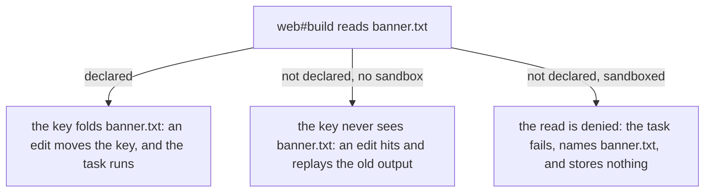

import StaleHit from '../../../components/demos/StaleHit.astro'

[Caching](../caching/) showed how a key is made from a task's inputs, and
how a hit goes wrong when the task reads something the key never saw. This
page is about that failure: why it is the worst one, where a list of inputs
can come from, and how a runner can prove the list is complete instead of
trusting it. It uses one small package, `web`, with one task, `build`. It
explains the idea first, then shows how vx does it, and how Turborepo, Nx
and Bazel do it.

After reading it you should be able to say why a cache hit is safe or
stale.

## The worst failure is a green run

A task runner's cache can fail in two directions.

- **A needless miss.** The key moved, but nothing the task reads changed.
  The task runs again and writes the same bytes. You lose time.
- **A [stale hit](../glossary/#cache-hit-miss-and-stale-hit).** The key did
  not move, but something the task reads did. The runner replays the old
  output. The run is green and the output is wrong.

The second is far worse. A miss is visible: the run is slow, and you can
ask why. A stale hit says nothing. The wrong bytes go into the next task,
into a test that passes against old code, into a deploy. With a remote
cache they go to every machine that computes the same key. And when
someone finally notices, the cause is a file that changed days ago, in a
run that looked fine.

So a runner that caches has to answer one question for every task: is the
list of [inputs](../glossary/#inputs) complete? A hit is safe only if it
is.

## Where the list comes from

There are two ways to get a task's list of inputs.

**Declared.** You write the list: `src/**` and `tsconfig.json`. The runner
hashes exactly those files. This is fast and predictable, and it proves
nothing. The list is a claim. If the command also reads `banner.txt` and
the list does not say so, every edit to `banner.txt` is a stale hit
waiting to happen. In the [playground](../playground/) you can add a file
that no config declares and see that no key moves.

**Inferred.** The runner works the list out itself. There are two ways to
do it.

- **A broad default.** Hash every file in the package. Nothing in the
  package can be missed, so this is the safer place to start. But the task
  reruns for files it never reads, such as a README, and anything outside
  the package still has to be declared: a file at the workspace root, an
  environment variable, a tool installed on the machine.
- **A trace.** Watch the task while it runs and record every file it opens.
  This sees what the task really read. But the list exists only after the
  task has run, so the key is not known in advance: a runner cannot look a
  task up before running it without checking the recorded reads again. And
  watching every file a process opens needs hooks into each operating
  system.

| How the list is made | Can it miss a read?               | Key known before the run? | Reruns for files the task does not read? |
| -------------------- | --------------------------------- | ------------------------- | ---------------------------------------- |
| Declared             | yes, any file you forget          | yes                       | no                                       |
| Broad default        | yes, anything outside the package | yes                       | yes                                      |
| Traced               | no, for what the run opened       | no                        | no                                       |

None of the three proves the list is complete before you trust a hit. A
declared list can be checked, though, and that is what a sandbox does.

## The sandbox turns the claim into a check

A [sandbox](../glossary/#hermeticity-and-sandboxing) runs the task where
only the files it was granted exist. Grant it the same files its inputs
declare, and a read of anything else fails:



The failure is the point. The forgotten file shows up the first time the
task runs, as an error that names it, instead of weeks later as a wrong
output that nobody can explain. And a failed task stores nothing, so the
cache never holds an entry built from a read its key did not see.

## Try it: a stale hit, then the sandbox that catches it

`web#build` runs `mkdir -p dist && cat src/index.ts banner.txt > dist/out.txt`. Its inputs
declare `src/**`, so the key sees `src/index.ts` and not `banner.txt`.
Step through five runs:

1. **First run.** The cache is empty. The task runs and stores its output.
2. **Edit `src/index.ts`.** The key moves. The task runs, and the output
   is right.
3. **Edit `banner.txt`.** The key does not move. The run hits and replays
   the output from step 2, with the old banner. That is the stale hit.
4. **Turn on `exec.sandbox`,** granting the same files the inputs declare.
   The sandbox block is part of the task's config, so the key moves and
   the task runs. It reads `banner.txt`, which it was not granted, and
   fails. vx prints the read it denied.
5. **Declare `banner.txt`** in the inputs and the grant. The key moves, the
   task runs, and the output is right again.

<StaleHit />

Step 4 misses rather than hitting the stale entry, and that matters. The
sandbox checks a run, and a hit does not run. A hit is only as good as the
run that stored it. Turning the sandbox on changes the config, and the
config is in the key, so the next run is a real one that the sandbox can
check.

## When there is no sandbox

The sandbox needs support from the operating system. vx does not run a
sandboxed task without it. If the sandbox cannot start (on Linux, a
missing `bwrap`, for example), the run stops with `sandbox not available:`
and the reason, and the task does not run at all. A run whose sandboxed
tasks all hit the cache never needs the sandbox and does not start it
([requirements](../../guides/sandboxing/#requirements--platform-support)).

## What it costs, and what it cannot see

- **Declaring is work, twice.** You list each task's inputs, and a
  sandboxed task also lists what it may read. vx derives neither list from
  the other: the inputs say what moves the key, and the grant says what the
  task may touch ([why they are separate](../../guides/sandboxing/#why-it-makes-caching-trustworthy)).
- **The check is only as narrow as the grant.** The sandbox denies what
  the grant leaves out, not what the inputs leave out. A task granted
  `read: ['.']`, the whole package, can read `banner.txt` with no error
  while its inputs still say `src/**`. The demo grants the same files the
  inputs declare, and that is what makes step 4 fail. On Linux a write
  grant for one file makes its whole directory readable, so keep outputs
  in a subdirectory ([the boundary](../../guides/sandboxing/#the-boundary-is-the-project)).
- **It checks files, not environment variables.** A variable passed to the
  task but not declared as an input is read freely, and an edit to it is a
  stale hit ([the two lists](../../guides/environment-variables/#the-two-lists)).
  The same goes for `node_modules`, which a sandboxed task may always read,
  and for a tool on the machine whose version is not in the key.
- **Linux and macOS only.** On Linux it uses bubblewrap, and needs `socat`
  and `ripgrep` too; `strace` turns a denial into the report. As root
  inside a container it is usually refused unless the task sets
  `weakerWhenNested`.
  On macOS it uses the system sandbox (seatbelt), whose log of denials can
  drop records under load: the read is still denied, but the report can
  miss it. Windows runs it under WSL.
- **Persistent tasks get no report.** A dev server runs inside the same
  walls, but the report is read after the task exits, and a server exits
  only when the run ends ([what can't be sandboxed](../../guides/sandboxing/#what-cant-be-sandboxed)).

## How vx does it

- **Inputs are declared and required.** A task is cached only if it has a
  `cache` block, and `cache.inputs.files` has no default. vx never infers
  inputs, by default or by trace
  ([why caching is opt-in](../../caching/#why-caching-is-opt-in)). A
  forgotten input costs a stale hit, and a missing cache block costs only a
  run, so vx makes you choose.
- **The sandbox is opt-in, per task.** `exec.sandbox` grants what the task
  may read and write. Any denial inside the task's own package fails the
  task, even when the command itself exits 0: a task that survives a
  denied read is exactly the run that would store a wrong output. A failed
  task is never cached ([fail on violation](../../guides/sandboxing/#fail-on-violation)).
- **The report is evidence.** vx prints each denied call as the operating
  system reported it, under `SANDBOX VIOLATIONS`. On Linux it reads the
  `strace` log of the task, so vx does trace a task, but only to report
  what the sandbox denied. The list of inputs stays yours.

The last step of the demo, as a config:

```ts
import { defineProject } from '@vzn/vx'

export default defineProject({
  tasks: {
    build: {
      exec: {
        command: 'mkdir -p dist && cat src/index.ts banner.txt > dist/out.txt',
        sandbox: { allow: { read: ['src/**', 'banner.txt'], write: ['dist/'] } },
      },
      cache: {
        inputs: { files: ['src/**', 'banner.txt'] },
        outputs: { files: ['dist/**'] },
      },
    },
  },
})
```

Tests hold this. Core's `tests/sandbox-runtime.unsafe.test.ts` runs the demo's
step 4 and step 5 for real, in the sandbox, and checks the exact line vx
reports. The same file checks that a task which survives an undeclared
read still fails ("the SAME task with its output in a subdirectory still
fails on that read"). The site's own `packages/vx-docs/tests/learn-correctness.test.ts`
runs vx over the demo's files to check its keys and hits, and builds the
report with vx's own formatter.

## How the others do it

These were checked against each tool's documentation on 2026-09-24.

- **Turborepo** hashes every file in the package that is checked into
  source control, unless the task lists `inputs`
  ([inputs](https://turborepo.com/docs/reference/configuration#inputs)).
  A file outside the package, such as a root `.env`, reaches the hash when
  `globalDependencies` lists it
  ([global hash inputs](https://turborepo.com/docs/crafting-your-repository/caching#global-hash-inputs)).
  Its documentation describes no sandbox. For caching problems it points
  to `--dry` and `--summarize`, which show a task's inputs and, compared
  across two runs, why the hashes differ
  ([troubleshooting](https://turborepo.com/docs/crafting-your-repository/caching#troubleshooting)).
- **Nx** includes every file under a project's root by default
  ([configure inputs](https://nx.dev/docs/concepts/how-caching-works#configure-inputs)),
  and its plugins infer tasks, with their inputs and outputs, from a tool's
  own config such as `vite.config.ts`
  ([inferred tasks](https://nx.dev/docs/concepts/mental-model#inferred-tasks)).
  Task sandboxing confines a task to its declared inputs and outputs and
  calls the stale result it prevents a "false cache hit". It is an Nx Cloud
  add-on that runs on a dedicated compute cluster. In Warning mode a
  violation is reported and the task completes; in Strict mode the task
  fails ([task sandboxing](https://nx.dev/docs/features/ci-features/sandboxing)).
- **Bazel** declares the inputs of every action. Its sandbox runs an
  action in a restricted, temporary execution root, which helps ensure it
  does not read undeclared inputs. Its glossary says the cost is not significant on Linux, and that
  on macOS it can make sandboxing unusable
  ([sandboxing](https://bazel.build/reference/glossary#sandboxing)). To
  find actions that are not hermetic, its docs suggest enabling strict
  sandboxing
  ([hermeticity](https://bazel.build/basics/hermeticity#troubleshooting-nonhermeticity)).

Hashing the whole package, as Turborepo and Nx do by default, is the
better choice while you adopt a runner: the files in the package are
covered without being listed, and there is nothing to type. The price is
reruns for files the task never reads, and no check on what lies outside
the package. Bazel is the strictest of the four, and the better choice
when a build is large enough to justify declaring the inputs of every
action. vx sits between them: you declare, and you can prove the
declaration on your own machine, task by task, without a cloud service.

## Checkpoint

You have reached step 5. Now you turn `exec.sandbox` off and run. Then you
stop declaring `banner.txt` and run again. What does each run do, and is
either output stale? Answer before you open the box, then check it with
the demo's toggles.

<details>
<summary>Answer</summary>

The first run misses and runs. The sandbox block is part of the task's
config, so removing it moves the key, and no run has stored that key yet.
The output is right.

The second run hits, and the hit is stale. The config and `src/index.ts`
are now what they were at step 3, so the key is step 3's key. The cache
still holds the entry that step 2 stored, with the old banner, and replays
it. The sandbox is off, so nothing checks the read.

</details>
