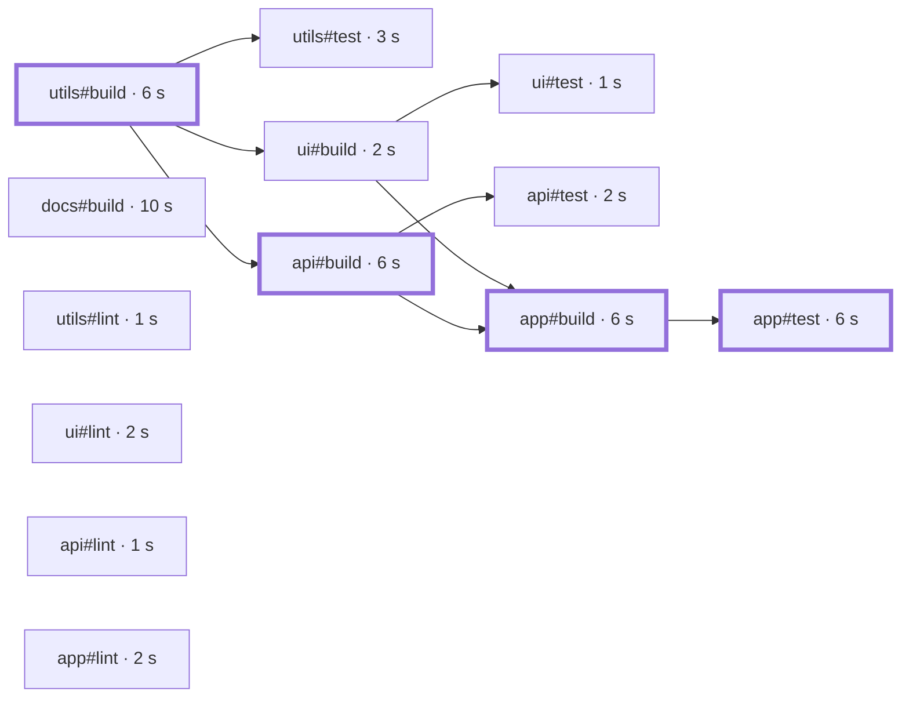

import NoHistoryTable from '../../../components/demos/NoHistoryTable.astro'
import SchedulerSim from '../../../components/demos/SchedulerSim.astro'

A [task graph](../glossary/#task-graph) says what must finish before
what. It does not say what to start when several tasks are ready at once.
That choice is the scheduler's. This page explains how a scheduler turns a
task graph into a run, why more workers stop helping, and why the order of
ready tasks matters. Then it shows how vx does it, and how Turborepo, Nx
and Bazel do it.

After reading it you should be able to read a task graph and say which
chain of tasks bounds the run.

## Workers

A runner starts a task as soon as every task it waits for has finished.
Often several tasks are ready at the same moment. A worker is a slot that
runs one task at a time, and a runner has a fixed number of them, usually
about one per CPU core.

This page uses the toy monorepo from
[What is task orchestration?](../what-is-task-orchestration/) with two
more kinds of task. Each package has a `lint` task, which waits for
nothing. And a documentation site adds `docs#build`, which waits for
nothing and which nothing waits for. Every task has a duration, made up
for the example. Together the thirteen tasks are 48 seconds of work.

## More workers, but not N times faster

On one worker the run takes 48 seconds: one task after another, and the
worker is never idle. On two workers it can take 24 seconds, half as long.
On three workers it still takes 24 seconds, and on four as well.

The reason is one chain of tasks: `utils#build`, then `api#build`, then
`app#build`, then `app#test`. Each of them waits for the one before, so
they run one after another however many workers there are. They take 6
seconds each, 24 in all. Extra workers can only run other tasks beside
that chain, and once every other task fits beside it, more workers change
nothing.

## The critical path

The longest chain of dependent work in a task graph is its
[critical path](../glossary/#critical-path). Here it is the chain above,
drawn with heavy borders:



Two numbers bound every run:

- **The critical path.** Its tasks run one at a time, so the run takes at
  least as long as the chain: 24 seconds here.
- **The work divided by the workers.** Two workers can do at most two
  seconds of work per second: 48 seconds of work takes at least 24
  seconds on two workers, and 16 on three.

The larger of the two is a lower bound. No scheduler finishes before it.
With enough workers the critical path is the bound, and the only way to
finish sooner is to make a task on it faster, or to split it.

## Why the order of ready tasks matters

On two workers, 24 seconds is possible. A scheduler does not get it for
free. At the start six tasks are ready: `utils#build`, the four lints and
`docs#build`. Only two can start, and which two decides how the run ends.

A common rule starts first the task that the most other tasks wait on.
`utils#build` has seven tasks waiting on it, so it starts. The lints and
the docs build have none, so they tie, and the tie goes to the order they
were listed in. `docs#build` starts only at 8 seconds and ends at 18. At 18
seconds `app#test`, the last task of the critical path, becomes ready,
but `utils#test` has just taken the free worker, and `ui#test` and
`api#test` were ready before it. `app#test` starts at 21 seconds, the run
ends at 27, and one worker is idle for the last 6.

A better rule starts first the task with the longest chain of work still
ahead of it, its own duration included. `utils#build` has 24 seconds
ahead of it, `docs#build` 10, and each lint 1 or 2. So `docs#build` starts
at once beside `utils#build`, and the short lints fill the gaps later.
The run ends at 24 seconds, on the lower bound.

<SchedulerSim />

With JavaScript on, the simulator reruns vx's own ranking code in your
browser on every change. Some things to try:

- Set the workers to 3. Both charts end at 24 seconds: with a spare
  worker, the order stops mattering.
- On 2 workers, make `docs#build` take 20 seconds. Now the work sets the
  bound, not the chain: 58 seconds over two workers is 29. Learned
  durations reaches it, and tasks waiting finishes at 30.
- Tick "No history" for `docs#build`, then for `ui#lint` instead, and
  compare the policies in the finish table. The next sections explain the
  difference.

## Priorities

A priority is the number a scheduler sorts ready tasks by. The simulator
has four:

- **Tasks waiting** counts, for each task, how many tasks wait on it,
  directly or through others. It needs no history, so it works on the
  first run. It cannot see durations: a 10-second task that nothing waits
  on ties with a 1-second lint.
- **Learned durations** is the remaining critical path: a task's own
  duration plus the longest chain of tasks after it. The durations are
  the medians of the task's past run times. A task with no history is
  given the median of every known task's duration.
- **True durations** is the same ranking with every duration known
  exactly. No real scheduler has that. It shows the best that history can
  buy.
- **No history first** is learned durations, except that a task with no
  history ranks above every task with some.

Even true durations do not guarantee the fastest order. Taking the
highest priority each time is a quick rule, not a search of every order,
and on some graphs another order finishes sooner.

## When a task has no history

History is learned from runs, so a new task has none. The history plugin
gives it the median duration. That is a guess, and it can be wrong in
either direction:

<NoHistoryTable />

If `docs#build` is new, the median guess is 2 seconds. It starts late and
the run takes 26 seconds. Starting tasks with no history first starts it
at once, and the run takes 24. If `ui#lint` is new instead, starting it
first takes a worker for its 2 seconds at the very start. Everything
behind it shifts, `app#build` starts 2 seconds late, and the run takes 26.
The median guess takes 24.

Which rule is better on real graphs is a measurement, not an argument.
vx measured it in item 669
([the record](https://github.com/vznjs/vx/blob/main/packages/vx-bench/schedule-policy.md)):
nine graph shapes of 200 to 2,000 tasks, 30 random seeds each, with 0 to
100 % of the tasks new to the history, on the same simulator this page
runs.

- With 5 to 25 % of the tasks new, which is a working repository that
  gained some tasks, no history first finished 0.69 % sooner than the
  median on average. True durations finished 0.82 % sooner, and tasks
  waiting 3.51 % later.
- On single graphs, no history first was up to 6.15 % slower in that range
  and up to 13.03 % slower overall (the diamond graph with 75 % of its
  tasks new). A new task that turns out short starts ahead of the long
  known chain, and the chain finishes last.
- The rule for adopting it was that no graph gets more than 1 % slower. It
  failed that rule, so the plugin keeps the median.

The average gain is small, and it is paid for with a slow tail. When you
know a new task is long, the plugin's `assume` option names its duration
until the history has one.

## Restore tier and exec tier

Everything above assumes that every task runs. In a run with a warm cache
many tasks do not run: their results are restored from the cache. vx
schedules those apart from the rest.

When the run's cache is local only, vx asks it, before the run starts,
about every task whose key it can compute before its dependencies run. The tasks that will hit form
the restore tier. The tasks that must run form the exec tier. A restore
is a copy from disk, not the task's work, so:

- **A restore does not take a worker.** Restores have their own lane, up
  to twice as many at once as there are workers. The tasks that must run
  keep every worker.
- **A restore does not wait for its dependencies.** Its result is already
  known, so it is ready at the start.

The ranking above sorts only the work that runs, and the history plugin's
estimate is "what if everything ran", which is the case where order
matters. [The local restore tier](../../caching/#local-restore-tier-two-tier-scheduler)
has the details, including which tasks cannot use it.

## How vx does it

- **Workers.** `--concurrency <n>` sets how many tasks run at once. The
  default is the number of CPU cores, capped by a container's CPU quota,
  and `concurrency` in `vx.workspace.ts` sets it for the workspace
  ([`concurrency`](../../guides/workspace-config/#concurrency)).
- **The default order is tasks waiting.** With no plugin, vx starts the
  ready task with the most tasks waiting on it, directly or through
  others, and breaks ties in graph order
  ([the scheduler](../../architecture/#graph--scheduler)).
- **Learned durations are a plugin.** `@vzn/vx-schedule-history` reads the
  local run history, takes each task's median over the last 20 runs, and
  ranks by remaining critical path. Its score sorts above the default,
  which only breaks ties. You add it in `vx.workspace.ts`:

```ts
import { defineWorkspace } from '@vzn/vx'
import { scheduleHistoryPlugin } from '@vzn/vx-schedule-history'

export default defineWorkspace({
  concurrency: 4,
  plugins: [scheduleHistoryPlugin({ assume: { 'docs#build': 10_000 } })],
})
```

`assume` names durations in milliseconds for tasks with no history yet,
such as on a fresh CI machine. A recorded median always wins over an
assumption ([`schedule` and `admit`](../../guides/plugins/#keys-and-order)).

The simulator on this page is not a model of that code. It bundles vx's
own ranking functions for the browser: core's count of waiting tasks and
the plugin's critical-path score, merged the way the scheduler merges
them. The loop that dispatches tasks is copied from the scheduler, and a
test replays it against the real scheduler and checks the same start
order, start times and finish time.

The cost of vx's choices: the default order needs no history, but it
cannot see that a task is long. The plugin can, but only after the task
has run a few times, and only in a workspace that declares it.

## How the others do it

- **Turborepo** runs up to `--concurrency` tasks at once, 10 by default
  ([`turbo run`](https://turborepo.com/docs/reference/run#--concurrency-number--percentage)).
  Its docs do not say which ready task it starts first.
- **Nx** runs up to `--parallel` tasks at once, 3 by default
  ([run tasks in parallel](https://nx.dev/docs/kb/run-tasks-in-parallel)).
  Its docs say that Nx Agents, on Nx Cloud, hand out tasks by their past
  run times and dependencies
  ([Nx Agents](https://nx.dev/docs/features/ci-features/distribute-task-execution)),
  but not how a local run orders ready tasks. Its source sorts them by
  how many tasks directly wait on each, then by how many projects depend
  on its project, and only among tasks equal on both starts one with no
  recorded time first
  ([`tasks-schedule.ts`](https://github.com/nrwl/nx/blob/master/packages/nx/src/tasks-runner/tasks-schedule.ts)).
- **Bazel** runs up to `--jobs` actions at once, and holds back an action
  whose estimated memory or CPU would not fit
  ([`--jobs`](https://bazel.build/docs/user-manual#jobs)). Its profiler
  shows the critical path of a finished build
  ([JSON trace profile](https://bazel.build/advanced/performance/json-trace-profile)),
  but its docs do not say how it orders ready actions.

## Lab: a bad order

This is the fourth of the [labs](../labs/). In the simulator above, a
long task that starts late makes the whole run late. Use the Workers
menu, the two chart menus and the Takes fields. Reset puts everything
back.

1. **Press Reset.** On 2 workers, the first chart is tasks waiting, vx
   with no plugin. It starts `docs#build` at 8 seconds and finishes at
   27. The second chart, learned durations, finishes at 24.
2. **Make `docs#build` take 20 seconds.** The critical path is still
   `utils#build`, `api#build`, `app#build` and `app#test`, 24 seconds.
   But 58 seconds of work on 2 workers takes at least 29, and that is the
   bound now. Tasks waiting finishes at 30, and learned durations at 29.
3. **Make it take 30 seconds.** The critical path grows: `docs#build`
   alone takes 30 seconds, longer than the chain. The bound is 34. Tasks
   waiting still starts `docs#build` at 8 seconds, because nothing waits
   on it, so it ranks with the lints and after every task that something
   waits on. The run finishes at 38. Learned durations starts it at once
   and finishes at 34, on the bound.
4. **Set the workers to 3.** Tasks waiting starts `docs#build` at 2
   seconds, after `ui#lint`, and finishes at 32. Learned durations
   finishes at 30, the length of the critical path. The spare worker
   helped, but the order still costs 2 seconds.

### What stopped it

Nothing in vx's core. Its default order counts the tasks waiting on each
task, and cannot see that `docs#build` is long. The history plugin,
`@vzn/vx-schedule-history`, ranks by the work still ahead of each task,
learned from past runs, and its `assume` option names a duration for a
task with no history yet ([How vx does it](#how-vx-does-it)).

### Would Turborepo, Nx or Bazel?

- **Turborepo's** docs say how many tasks it runs at once, but not which
  ready task it starts first
  ([`turbo run`](https://turborepo.com/docs/reference/run#--concurrency-number--percentage)).
- **Nx's** docs say that Nx Agents, on Nx Cloud, pick up tasks by their
  processing time from historical data and by their dependencies
  ([Nx Agents](https://nx.dev/docs/features/ci-features/distribute-task-execution)),
  but not how a local run orders ready tasks.
- **Bazel's** docs do not say how it orders ready actions. Its profiler
  shows the critical path of a finished build
  ([JSON trace profile](https://bazel.build/advanced/performance/json-trace-profile)).

## Checkpoint

The default graph runs in 24 seconds on two workers. You add a third
worker. When does the run finish, and which tasks decide that? Answer
before you open the box, then check it in the simulator.

<details>
<summary>Answer</summary>

It still finishes at 24 seconds. `utils#build`, `api#build`, `app#build`
and `app#test` each wait for the one before, and together they take 24
seconds, however many workers there are.

To finish sooner, make a task on that chain faster. Set `api#build` to 3
seconds and the critical path drops to 21 seconds, still through
`utils#build`, `api#build`, `app#build` and `app#test`, and three workers
finish in 21.

</details>
