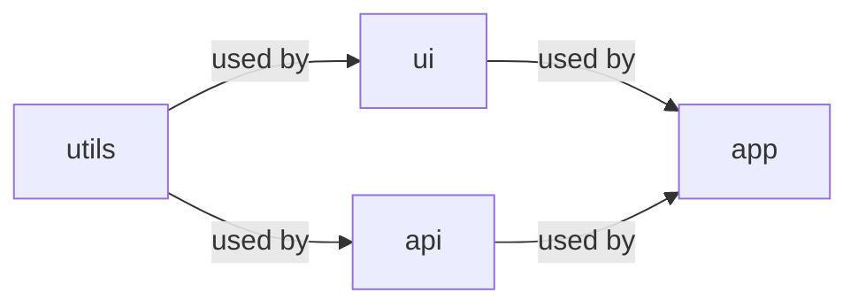
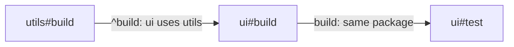

import GraphExplorer from '../../../components/demos/GraphExplorer.astro'

You know `npm run build`. It runs one script in one package. This page is
about what changes when one repository holds many packages that use each
other, which is called a monorepo. It explains the idea first, in terms
that fit any tool. Then it shows how vx does it, and how Turborepo, Nx and
Bazel do it.

After reading it you should be able to read a task graph and say what a
change reruns.

## A task

A task is one command in one package: `build` in the `ui` package, or
`test` in the `app` package. This page writes it as `package#task`, so
those two are `ui#build` and `app#test`. Turborepo and vx spell it that
way; Nx writes `ui:build`.

In a repository with one package, a task is a script in `package.json`,
and `npm run build` is all you need.

## A dependency

A task often needs another task's result before it can start. The `app`
package imports `ui`, so `ui` must be built before `app` can be built. And
`ui#test` tests the built code, so it needs `ui#build` first.

That is a dependency: "`app#build` depends on `ui#build`" means `ui#build`
must finish before `app#build` starts.

## A toy monorepo

The rest of the page uses four packages. `utils` holds shared helpers.
`ui` and `api` both use `utils`. `app` uses `ui` and `api`. Each
package's `package.json` lists the packages it uses, the same way it lists
anything from npm.



Every package has two tasks, `build` and `test`. Two rules connect them,
and they are the two rules almost every JavaScript monorepo writes:

1. **`build` needs the `build` of every package it uses.** Tools write this
   as `^build`. The `^` means "in the packages I depend on".
2. **`test` needs `build` in the same package.** Tools write this as plain
   `build`.

Here are the two rules applied to `ui`:



## The task graph

Apply both rules to every package and you get the task graph. It has one
node per task and one arrow per dependency. It is the whole plan: which
tasks exist, and what must finish before what.

<GraphExplorer />

Read the diagram from the top. `utils#build` needs nothing, so it can
start at once. Everything else waits for at least one arrow into it.

## Why `npm run` stops scaling

With four packages you have eight tasks. You can still run them by hand, or
with a shell script:

```sh
cd packages/utils && npm run build && npm test
cd ../ui && npm run build && npm test
cd ../api && npm run build && npm test
cd ../app && npm run build && npm test
```

npm's `--workspaces` flag does much the same thing: it runs a script in
each package in turn, in the order the workspaces are listed, without
reading which package uses which
([npm workspaces](https://docs.npmjs.com/cli/using-npm/workspaces)). Both work for four packages. They stop
working as the repository grows, in four ways.

**Ordering.** The script encodes the order by hand. Add a package, or make
`api` use `ui`, and the order is wrong until someone notices. The task
graph gets the order from the `package.json` files, so it cannot drift from
them.

**Parallelism.** The script runs one command at a time. But `ui#build`
and `api#build` do not need each other, and a machine with several cores
could run them together. The graph says which tasks may overlap: the
diagram above sorts the eight tasks into four waves, and every task in a
wave can run at the same time as the others in it. Eight steps become four.

**Rerunning only what changed.** You edit a file in `ui`. The script
rebuilds and retests all four packages. But `utils` and `api` do not use
`ui`, so nothing they produce can have changed. Only `ui`'s tasks and the
tasks of packages that use `ui` (here `app`) need to run again. That set
is what the change **affects**.

**Caching.** Some tasks in the affected set may still have the same inputs
as a run you already did, for example after you undo an edit. A cache
stores each task's result under a key made from its inputs, and gives it
back the next time the key matches, instead of running the task again.
[Caching, from first principles](../caching/) is the next page.

A task orchestrator, or task runner, is the tool that does these four
things for you. It builds the task graph, runs the graph in a valid order
with as much in parallel as the machine allows, selects what a change
affects, and reuses cached results.

## Waves: a valid order

A task with no dependencies is in wave 1. Every other task is in the wave
after its latest dependency. So `app#build` is in wave 3, one after
`ui#build` and `api#build` in wave 2. Any order that finishes each wave
before starting the next one is a valid order.

Waves are the simplest way to see the parallelism, but a real scheduler
does not wait for a whole wave. It starts each task as soon as its own
dependencies finish. Suppose `ui#build` takes ten seconds and `api#build`
takes one. `api#test` needs only `api#build`, so it can start as soon as
`api#build` is done. Waiting for the end of wave 2 would leave it idle for
nine seconds.
[Scheduling](../scheduling/) covers how a runner picks among the tasks
that are ready.

## What a change affects

A change affects the package you edited and every package that uses it,
directly or through another package. Tools that compute it use git: the
files changed since a base commit, the packages that own those files, and
then every package that depends on one of them.

Choose `ui` in the explorer above. Four tasks light up: `ui#build`,
`ui#test`, `app#build` and `app#test`. Two more are dashed: `utils#build`
and `api#build`. The run needs their results, because `ui#build` and
`app#build` depend on them, but nothing they read changed. So a cache from
an earlier run restores them instead of running them. The tasks of `utils`
and `api` that nothing in the run needs, `utils#test` and `api#test`,
stay out.

## How vx does it

Each package has a `vx.config.ts`. It declares the package's tasks and
their dependencies with the same two rules:

```ts
import { defineProject } from '@vzn/vx'

export default defineProject({
  tasks: {
    build: {
      dependsOn: ['^build'],
      exec: { command: 'tsc -b' },
      cache: { inputs: { files: ['src/**', 'tsconfig.json'] }, outputs: { files: ['dist/**'] } },
    },
    test: {
      dependsOn: ['build'],
      exec: { command: 'bun test' },
      cache: { inputs: { files: ['src/**', 'tests/**'] }, outputs: { files: [] } },
    },
  },
})
```

- **The graph.** vx reads which packages use which from the `package.json`
  files, so `^build` needs no list of packages. The
  [`dependsOn` reference](../../schema/#dependson-optional) has every form
  it accepts, and [Task dependencies](../../guides/task-dependencies/)
  walks through them.
- **The order.** `vx run build test --all` runs the whole graph. vx
  starts each task as soon as its dependencies finish, up to
  `--concurrency` tasks at once. When several are ready, it starts the one
  that the most other tasks wait on
  ([the scheduler](../../architecture/#graph--scheduler)).
- **The affected set.** `vx run build test --affected` runs the tasks of
  the packages changed since `origin/HEAD` and of every package that
  depends on them ([`--affected`](../../cli/#--affectedbase)).
- **The cache.** A task is cached only if it declares a `cache` block,
  and `cache.inputs.files` has no default: you list the files the task
  reads ([why caching is opt-in](../../caching/#why-caching-is-opt-in)).

That last choice has a cost. You type the globs for every task, and a file
you leave out is a file whose edit does not rerun the task. In return, the
key follows what you declared, so an edit to a file the task does not read,
such as a README, does not rerun it. The opt-in sandbox ([sandboxing](../../guides/sandboxing/)) closes the gap: a
sandboxed task that reads a file its inputs never named fails and names
the file.

## How the others do it

- **Turborepo** declares tasks in a root `turbo.json` that applies to
  every package, where `"dependsOn": ["^build"]` means the same as above
  ([`dependsOn`](https://turborepo.com/docs/reference/configuration#dependson)).
  `turbo run` takes an `--affected` flag too
  ([`turbo run`](https://turborepo.com/docs/reference/run)).
- **Nx** builds a project graph from your `package.json` files and your
  source imports ([the project graph](https://nx.dev/docs/features/explore-graph)),
  and `targetDefaults` in `nx.json` gives every project's `build` the same
  `"dependsOn": ["^build"]`
  ([`targetDefaults`](https://nx.dev/docs/reference/nx-json#target-defaults)).
- **Bazel** has no package-wide tasks: `BUILD` files declare targets with
  rules, and each target names its source files and the targets it depends
  on ([BUILD files](https://bazel.build/concepts/build-files)).

Turborepo and Nx hash every file in the package unless you narrow a
task's inputs
([Turborepo](https://turborepo.com/docs/reference/configuration#inputs),
[Nx](https://nx.dev/docs/reference/inputs)). That is less
to type than vx asks for, and it is the better default when you would
rather over-run than declare. Bazel knows the exact input files of every
step it runs, which makes it the most precise of the four, at the price of
writing `BUILD` files for everything.

## Checkpoint

You edit `packages/ui/src/button.ts` and run
`vx run build test --affected`. Which tasks run, and which of them can run
at the same time? Answer before you open the box, then check it with the
explorer.

<details>
<summary>Answer</summary>

Four tasks run: `ui#build`, `ui#test`, `app#build` and `app#test`.
`ui#build` goes first. Then `ui#test` and `app#build` can run at the same
time, because neither needs the other. `app#test` goes last.

The run also needs `utils#build` and `api#build`, because `ui#build` and
`app#build` depend on them. Nothing they read changed, so a cache from an
earlier run restores them instead of running them. `utils#test` and
`api#test` do not run at all.

</details>
