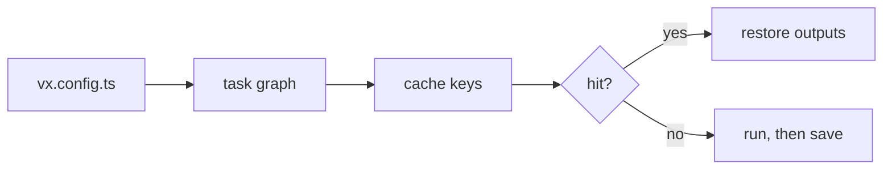

vx 0.0.1 shipped on 2026-05-13 and 0.0.21 on 2026-09-13. Those 21
releases built the foundation every later one stands on: a task graph
from TypeScript configs, a cache keyed on content, and seams for
plugins. This post covers what a new user meets, as it shipped then and
as it still works today.

**In this release**

- [Tasks in TypeScript, one graph](#tasks-in-typescript-one-graph)
- [A content-addressed cache](#a-content-addressed-cache)
- [Filters and affected runs](#filters-and-affected-runs)
- [Watch mode](#watch-mode)
- [Dev servers in the graph](#dev-servers-in-the-graph)
- [The sandbox](#the-sandbox)
- [vx why and vx last](#vx-why-and-vx-last)
- [vx lock and frozen runs](#vx-lock-and-frozen-runs)
- [Plugins on seams](#plugins-on-seams)
- [Adopting from Turborepo and Nx](#adopting-from-turborepo-and-nx)

## Tasks in TypeScript, one graph

Each package declares its tasks in a `vx.config.ts`. A task is one shell
command, and `dependsOn` orders it: `'^build'` means `build` in every
package this one depends on. vx discovers the projects, evaluates every
config, and builds one graph for the whole workspace. A config is a
program, so shared settings are an import, not a special field.

```ts
// packages/app/vx.config.ts
import { defineProject } from '@vzn/vx/config'

export default defineProject({
  tasks: {
    build: {
      dependsOn: ['^build'],
      exec: { command: 'tsc -b' },
      cache: { inputs: { files: ['src/**'] }, outputs: { files: ['dist/**'] } },
    },
  },
})
```

Commit [4e7e62e](https://github.com/vznjs/vx/commit/4e7e62ebec80c1d7d3d2415f21680f28dc875009).
Docs: [Tasks and dependencies](../../guides/configure/#tasks-and-dependencies).
Deep dive: [Config in TypeScript](../../blog/config-in-typescript/).



## A content-addressed cache

Caching is opt-in, and a cached task lists its input files. vx never
guesses them. The key folds those files, the task's resolved config,
the package's `package.json`, the lockfile and the keys of the tasks it
depends on. Tracked, clean files are keyed by the blob ids already in
git's index, so a warm run reads almost nothing. Entries live in a local
SQLite index with compressed archives, and a hit restores the outputs
and replays the logs.

```txt frame="terminal"
$ vx run build --all

─ vx 0.0.0 ───────────────────────────────────────────────────
  projects  ▰▰▰▰▰▰▰▰▰▰▰▰▰▰▰▰▰▰▰▰▰▰▰▰▰▰▰▰▰▰▰▰▰▰▰▰▰▰▰▰▰▰▰▰▰▰▰▰▰▰
            2 in run · 2 total
  tasks     ▰▰▰▰▰▰▰▰▰▰▰▰▰▰▰▰▰▰▰▰▰▰▰▰▰▰▰▰▰▰▰▰▰▰▰▰▰▰▰▰▰▰▰▰▰▰▰▰▰▰
            2 success · 2 total
  cache     ▰▰▰▰▰▰▰▰▰▰▰▰▰▰▰▰▰▰▰▰▰▰▰▰▰▰▰▰▰▰▰▰▰▰▰▰▰▰▰▰▰▰▰▰▰▰▰▰▰▰
            2 up-to-date

  info      4 workers · local cache
  time      32ms
  result    2 tasks · all cached · 45ms saved · 32ms
```

PRs [#7](https://github.com/vznjs/vx/pull/7), [#86](https://github.com/vznjs/vx/pull/86),
commit [613d527](https://github.com/vznjs/vx/commit/613d5279a7ae189c0d29a0b08c9874aac5ca8e7f).
Docs: [Caching](../../guides/configure/#caching).
Deep dives: [Explicit over magical](../../blog/explicit-over-magical/),
[Keys from git](../../blog/keys-from-git/),
[Cascade through inputs](../../blog/cascade-through-inputs/).

## Filters and affected runs

`--filter` takes pnpm-style patterns: a name, a glob, a path, a
package with its dependencies (`app...`) or dependents (`...lib`).
`--affected` selects what changed since a git base, `origin/HEAD` by
default. A change to a workspace-level file that every key folds, such
as a lockfile no plugin claims, widens it to every project. A later
release made `--affected` include the changed projects' dependents too.

```sh frame="terminal"
vx run test --affected
```

PRs [#58](https://github.com/vznjs/vx/pull/58), [#210](https://github.com/vznjs/vx/pull/210).
Docs: [CLI](../../cli/).

## Watch mode

`vx watch` runs a task, then runs it again on every change. Each cycle
is a normal `vx run`, so the cache key decides what re-runs, and an edit
to an unrelated file costs a fully cached cycle. A task that writes into
its own project does not trigger itself: a cycle starts only when file
contents differ, not on every event.

```sh frame="terminal"
vx watch test --all
```

PR [#67](https://github.com/vznjs/vx/pull/67).
Deep dive: [Watch mode](../../blog/watch-mode/).

## Dev servers in the graph

`exec.persistent` marks a server or watcher that does not exit. Its
dependents start once it prints a line matching `readyWhen`, not after a
sleep. When the run ends, vx stops the server, and Ctrl-C leaves nothing
running.

```ts
// packages/web/vx.config.ts
import { defineProject } from '@vzn/vx/config'

export default defineProject({
  tasks: {
    dev: {
      exec: { command: 'vite', persistent: { readyWhen: 'Local:' }, timeout: 30_000 },
    },
    e2e: {
      dependsOn: ['dev'],
      exec: { command: 'playwright test' },
    },
  },
})
```

PRs [#62](https://github.com/vznjs/vx/pull/62), [#189](https://github.com/vznjs/vx/pull/189).
Docs: [Dev tasks](../../guides/configure/#dev-tasks).
Deep dives: [Dev servers in the graph](../../blog/dev-servers-in-the-graph/),
[Ctrl-C](../../blog/ctrl-c/).

## The sandbox

`exec.sandbox` runs a task where only what you granted exists. You
declare capabilities (`read`, `write`, `network`) and vx maps them to
bubblewrap on Linux and the system sandbox on macOS. An undeclared read
or write of the task's own files fails the task and names the path, and
a failed task is never cached. That turns an input list from a promise
into a checked boundary.

```ts
// packages/app/vx.config.ts
import { defineProject } from '@vzn/vx/config'

export default defineProject({
  tasks: {
    build: {
      exec: {
        command: 'vite build',
        sandbox: { allow: { read: ['.'], write: ['dist/**'] } },
      },
      cache: { inputs: { files: ['src/**', 'index.html'] }, outputs: { files: ['dist/**'] } },
    },
  },
})
```

PRs [#15](https://github.com/vznjs/vx/pull/15), [#102](https://github.com/vznjs/vx/pull/102),
[#245](https://github.com/vznjs/vx/pull/245),
commit [d7f6e74](https://github.com/vznjs/vx/commit/d7f6e74af7e82c51301223b7912b725a7cad9c8d).
Docs: [Sandboxing tasks](../../guides/sandboxing/).
Deep dive: [The sandbox](../../blog/the-sandbox/).

## vx why and vx last

`vx why` compares a task's last two runs and names what moved its key: a
file, an env var, a config field, an upstream task. `vx last` replays a
recorded run's summary from local history. Both read only what the runs
already stored.

```txt frame="terminal"
$ vx why lib#build
lib#build — run 01a11d16-a5b0-74af-a52d-bb0bbf33a1ed
  this run   2026-10-08T19:56:25.939Z · success · executed · key 49a37e4bfb0bd487
  previous   2026-10-08T19:56:18.576Z · cache-hit · up-to-date · key e291b2e50af34f01
  verdict    cache key changed: file packages/lib/src/index.js

  what changed (1 component, 4 unchanged):
    changed file  packages/lib/src/index.js  09b76aaa26ac6afc3f6b09805e8ede78e0637954 → 838198e50b78e865ce6cde1f69d359ffeacc3063

  what to do:
    file  an edit re-runs by design; a file the task does not read belongs out of cache.inputs.files
```

Commits [7edfaeb](https://github.com/vznjs/vx/commit/7edfaebe7627d8cfd6a141554320beb98f5eb6dc),
[4013941](https://github.com/vznjs/vx/commit/4013941a0d28cbe5195ca32571a62a61d568c360),
PR [#333](https://github.com/vznjs/vx/pull/333).
Docs: [Why did it re-run?](../../guides/configure/#why-did-it-re-run).
Deep dive: [Why did this re-run?](../../blog/why-did-this-rerun/).

## vx lock and frozen runs

`vx lock` writes every project's resolved config to `vx-lock.json`.
`vx run --frozen` builds the graph from that file instead of evaluating
configs, and `vx lock --check` fails when the two drift. Run both in CI
and the graph a run sees is the one you reviewed.

```txt frame="terminal"
$ vx lock
vx lock: locked 2 project configs → vx-lock.json
$ vx lock --check
vx lock --check: up to date (2 projects)
```

Commit [133a55a](https://github.com/vznjs/vx/commit/133a55a1b534377484825b47b498b1fca5dc6275).
Docs: [A frozen graph](../../guides/ci/#a-frozen-graph).
Deep dive: [vx lock](../../blog/lock-and-frozen/).

## Plugins on seams

Core runs and caches on this machine and applies no plugin by default.
Everything else is a plugin declared in `vx.workspace.ts`, named by its
package. By 0.0.21 these shipped: `@vzn/vx-reapi` (remote cache and
remote execution on any Bazel REAPI server), `@vzn/vx-lockfile` (each
package keyed on its own dependencies), `@vzn/vx-otel` (OpenTelemetry),
a GitHub Actions job summary (today `@vzn/vx-ci`), `@vzn/vx-mcp` (a
`vx mcp` server for coding agents) and `@vzn/vx-schedule-history`.

```ts
// vx.workspace.ts
import { defineWorkspace } from '@vzn/vx/config'
import { bun } from '@vzn/vx-lockfile'
import { reapi } from '@vzn/vx-reapi'

export default defineWorkspace({
  plugins: [bun(), reapi({ endpoint: 'grpcs://cache.internal:443' })],
})
```

PR [#259](https://github.com/vznjs/vx/pull/259),
commits [02d6b67](https://github.com/vznjs/vx/commit/02d6b67b4b904d28ed3fa27e8fa214c0878b8acc),
[a485690](https://github.com/vznjs/vx/commit/a485690c3def0f7dd4c1d6f8f122533c374fec50),
[b5e534d](https://github.com/vznjs/vx/commit/b5e534d39d8ecdf6483f80f79a945138df5ab132).
Docs: [Plugins](../../guides/plugins/).
Deep dives: [A pipeline with seams](../../blog/pipeline-with-seams/),
[Remote execution](../../blog/remote-execution/),
[Lockfile-aware keys](../../blog/lockfile-aware-keys/),
[Agents and MCP](../../blog/agents-and-mcp/).

## Adopting from Turborepo and Nx

`@vzn/vx-migrate` covers adoption. Its `turbo()` plugin runs a Turbo
repo under vx with nothing written, reading `turbo.json` and the
package scripts each run. `bunx @vzn/vx-migrate` writes native
`vx.config.ts` files from `turbo.json` or an Nx graph, and
`turboCache()` and `nxCache()` keep an existing remote cache. In any
other repo, `vx init` writes starter configs from the `package.json`
scripts.

```sh frame="terminal"
bunx @vzn/vx-migrate
```

PR [#302](https://github.com/vznjs/vx/pull/302),
commit [1487872](https://github.com/vznjs/vx/commit/14878720a463e532520eac5c8e206d5e8fd9a1f1).
Docs: [Migrate](../../guides/migrate/).
Deep dives: [From Turborepo](../../blog/from-turborepo/), [From Nx](../../blog/from-nx/).

## Breaking changes

- The package became `@vzn/vx`, and a project config lists `tasks`
  directly, with no `run: { tasks }` wrapper
  ([#43](https://github.com/vznjs/vx/pull/43)).

See [Upgrading](../../guides/upgrading/).

## How to update

```sh frame="terminal"
npm install -D @vzn/vx@latest
```

A standalone binary updates itself with `vx upgrade`.

## Learn more

- [Quickstart](../../quickstart/)
- [Benchmarks](../../benchmarks/)
- [Every release on GitHub](https://github.com/vznjs/vx/releases)
