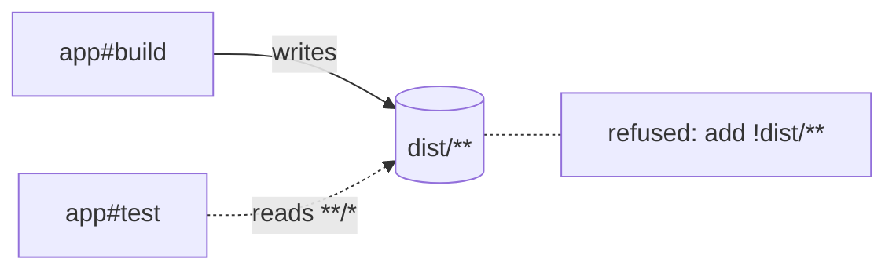

vx 0.0.521 to 0.0.589 shipped on 2026-10-07. The theme is fewer surprises:
the graph refuses configs that would delete files or slow every run, a
fully cached run boots nothing it does not need, and telemetry tells you
why a task rebuilt.

**In this release**

- [Keys known before anything runs](#keys-known-before-anything-runs)
- [One output path, one task](#one-output-path-one-task)
- [Outputs that would delete your sources](#outputs-that-would-delete-your-sources)
- [Servers only cache hits need stay off](#servers-only-cache-hits-need-stay-off)
- [Live OpenTelemetry export](#live-opentelemetry-export)
- [vx-migrate declares and installs plugins](#vx-migrate-declares-and-installs-plugins)
- [Faster all-cached runs](#faster-all-cached-runs)
- [vx watch follows what you asked for](#vx-watch-follows-what-you-asked-for)
- [Forwarded args reach the command](#forwarded-args-reach-the-command)
- [Cache correctness fixes](#cache-correctness-fixes)

## Keys known before anything runs

A task whose input globs could match another task's outputs used to get a
preliminary key: vx could not probe, prefetch or restore it ahead of the
schedule. The new `rules.upfrontKeys` refuses such a task at load and
names the `!` entry that fixes it. It is on by default. The producer's
key already reaches the reader through `dependsOn`, so excluding its
outputs loses nothing. `rules: { upfrontKeys: false }` in
`vx.workspace.ts` keeps the old waiting path.

```txt frame="terminal"
vx: app#test reads "**/*" in cache.inputs.files, which matches app#build's
output "dist/**": a task's key must not read another task's outputs (the
dependency's key already cascades through dependsOn). Exclude it: add
"!dist/**" to app#test's cache.inputs.files, or set rules: { upfrontKeys:
false } in vx.workspace.ts to let it wait for its producer.
```

PR [#2846](https://github.com/vznjs/vx/pull/2846). Docs:
[Workspace config](../../guides/configure/#workspace-config).

## One output path, one task

Two tasks whose outputs overlapped were allowed when a `dependsOn` edge
ordered them. That was correct, but every run of the dependant paid for a
stamp, a diff and a clean. `rules.exclusiveOutputs`, on by default,
refuses the ordered pair too. Give each task its own output path, or set
`rules: { exclusiveOutputs: false }` to keep the additive path. Output
globs that overlap without sharing a prefix, such as `dist/**/*.js`
beside `dist/sth/**`, are now caught as well.

```txt frame="terminal"
vx: app#types and app#build both declare the output "dist/**" in
cache.outputs.files: vx cleans a task's declared outputs before it runs
and before a cache-hit restore, so whichever of these runs second DELETES
the other's output. Give each task its own output path, or set rules: {
exclusiveOutputs: false } in vx.workspace.ts to let a dependant add to its
upstream's outputs.
```



PRs [#2845](https://github.com/vznjs/vx/pull/2845),
[#2841](https://github.com/vznjs/vx/pull/2841). Deep dive:
[Strict output ownership](../../blog/strict-output-ownership/).

## Outputs that would delete your sources

vx removes a task's outputs before it runs. A formatter that declared
`src/**` as both inputs and outputs had every committed file under `src`
deleted. The graph now refuses it, whatever the rules, and says what to
do instead.

```txt frame="terminal"
vx: app#fmt: every file "src/**" in cache.inputs.files selects is also its
own output: vx removes a task's outputs before it runs, so the task would
delete its own sources. A task that rewrites files in place (a formatter)
declares no outputs.
```

PR [#2847](https://github.com/vznjs/vx/pull/2847).

## Servers only cache hits need stay off

A `persistent` task pulled in as a dependency booted on every run, and its
dependants waited for it to be ready even when they were cache hits. Now
vx holds such a server dormant. It starts only if a dependant misses, and
otherwise never spawns. A fully cached `vx run e2e#test` over `web#dev`
went from 2.2 s to under 190 ms. Dependants in the server's own project
still wait for it.

```sh frame="terminal"
vx run e2e#test
```

<div class="vx-charts"><figure class="vx-bars"><figcaption>Cached vx run e2e#test over web#dev</figcaption><div class="vx-bar" style="--w:100%"><span class="vx-bar-name">before</span><span class="vx-bar-value">2.2 s</span><span class="vx-bar-track"><span class="vx-bar-fill"></span></span></div><div class="vx-bar vx-bar-lead" style="--w:8.6%"><span class="vx-bar-name">after</span><span class="vx-bar-value">under 190 ms</span><span class="vx-bar-track"><span class="vx-bar-fill"></span></span></div></figure></div>

PR [#2851](https://github.com/vznjs/vx/pull/2851). Deep dive:
[Dev servers in the graph](../../blog/dev-servers-in-the-graph/).

## Live OpenTelemetry export

`@vzn/vx-otel` now sends each task as it ends, batched once a second, so a
dashboard follows a CI run while it runs. `live: false` sends it all at
the end. Traces, metrics and logs share one resource key. Task spans gain
the command, queue wait, input file count, artifact size, save and fetch
time, and for a miss, what its key changed since the last saved entry.
On CI, every signal links back to the run and the pull request.

```sh frame="terminal"
OTEL_EXPORTER_OTLP_ENDPOINT=http://localhost:4318 vx run build --all
```

PRs [#2786](https://github.com/vznjs/vx/pull/2786),
[#2787](https://github.com/vznjs/vx/pull/2787),
[#2792](https://github.com/vznjs/vx/pull/2792),
[#2794](https://github.com/vznjs/vx/pull/2794). Docs:
[OpenTelemetry](../../guides/plugins/#opentelemetry).

## vx-migrate declares and installs plugins

A migrated repo used to end with a note asking you to declare the lockfile
plugin yourself. `@vzn/vx-migrate` now writes the plugins into
`vx.workspace.ts` and installs them at its own version: the lockfile's
`@vzn/vx-lockfile` plugin, `scheduleHistoryPlugin()`, and `github()` from
`@vzn/vx-ci` when `.github/workflows` exists. Written files no longer
carry a "Generated by" header. vx also stops printing cache upkeep
notices on upgrade.

```sh frame="terminal"
npx @vzn/vx-migrate
```

PR [#2777](https://github.com/vznjs/vx/pull/2777). Docs:
[One command](../../guides/migrate/#one-command).

## Faster all-cached runs

Several cuts to the warm path. Task globs match through one RegExp per
side instead of a dozen `Bun.Glob` calls per file. `@vzn/vx-lockfile`,
`@vzn/vx-ci` and `@vzn/vx-mcp` load their internals only when used, and
`@vzn/vx-otel` imports in 1.4 ms instead of 9.6 ms. A repo with no remote
no longer spawns two git commands on the run path. Together they make
the all-cached run of the vx repo itself 25% faster.

```sh frame="terminal"
vx run build --all
```

<div class="vx-charts"><figure class="vx-bars"><figcaption>@vzn/vx-otel import</figcaption><div class="vx-bar" style="--w:100%"><span class="vx-bar-name">before</span><span class="vx-bar-value">9.6 ms</span><span class="vx-bar-track"><span class="vx-bar-fill"></span></span></div><div class="vx-bar vx-bar-lead" style="--w:14.6%"><span class="vx-bar-name">after</span><span class="vx-bar-value">1.4 ms</span><span class="vx-bar-track"><span class="vx-bar-fill"></span></span></div></figure></div>

PRs [#2785](https://github.com/vznjs/vx/pull/2785),
[#2788](https://github.com/vznjs/vx/pull/2788),
[#2842](https://github.com/vznjs/vx/pull/2842).

## vx watch follows what you asked for

`vx watch lib#build` watched every project; it now watches `lib` and the
projects other `pkg#task` arguments name. `vx watch --affected` re-runs
tasks for edits made after it started, not only those in the starting
diff. An edit inside a nested project no longer triggers a cycle on the
root project.

```sh frame="terminal"
vx watch lib#build
```

PRs [#2828](https://github.com/vznjs/vx/pull/2828),
[#2827](https://github.com/vznjs/vx/pull/2827),
[#2832](https://github.com/vznjs/vx/pull/2832).

## Forwarded args reach the command

Args after `--` now reach a command that ends in a heredoc or a trailing
newline, where before they never arrived or ran as a command of their own
(`--watch: not found`). The `$` line in the output shows the command with
the args, as it ran.

```sh frame="terminal"
vx run test -- --watch
```

PRs [#2790](https://github.com/vznjs/vx/pull/2790),
[#2802](https://github.com/vznjs/vx/pull/2802),
[#2831](https://github.com/vznjs/vx/pull/2831).

## Cache correctness fixes

Several runs could store or replay wrong bytes under a green result. A
file added under an input glob while the command ran is now caught and
the save withheld. Committed files under a `node_modules` directory, such
as test fixtures, are part of the key again. The clean before a run no
longer follows an output directory linked to another directory in the
project. A dependant that deletes its upstream's files no longer gets
them restored on every hit.

```sh frame="terminal"
vx run build --all
```

PRs [#2854](https://github.com/vznjs/vx/pull/2854),
[#2793](https://github.com/vznjs/vx/pull/2793),
[#2795](https://github.com/vznjs/vx/pull/2795),
[#2822](https://github.com/vznjs/vx/pull/2822),
[#2823](https://github.com/vznjs/vx/pull/2823).

## Breaking changes

- `CACHE_VERSION` is now `vx-cache-v40`: every cached task misses once after
  the upgrade ([#2825](https://github.com/vznjs/vx/pull/2825)).

See [Upgrading](../../guides/upgrading/).

## How to update

```sh frame="terminal"
npm install -D @vzn/vx@latest
```

A standalone binary updates itself with `vx upgrade`.

## Learn more

- [Quickstart](../../quickstart/)
- [Benchmarks](../../benchmarks/)
- [Every release on GitHub](https://github.com/vznjs/vx/releases)
