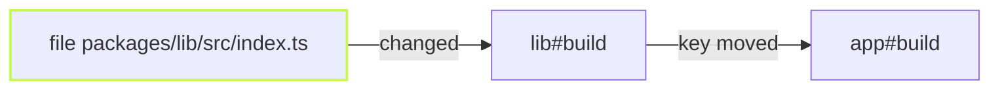
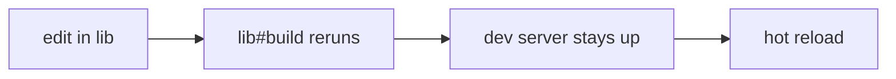

vx 0.0.590 to 0.0.625 all shipped on 2026-10-08. This batch is about
answers: how long a run has left, why a task re-ran, and where a config
is wrong. It also brings Vite Task and Lerna migration, a dev server that
stays up under `vx watch`, and faster warm runs on large workspaces.

> **Measurement scope:** Timings below remain the dated measurements of
> their stated paths and workloads, not a universal runner ranking. See the
> separate [scheduling counterexample](../../benchmarks/#synthetic-scheduling-counterexample)
> and its retained preliminary case; wall time includes scheduling delay,
> and default vx priority counts dependents rather than task durations.

**In this release**

- [Live run end forecast](#live-run-end-forecast)
- [vx why walks to the root cause](#vx-why-walks-to-the-root-cause)
- [Config errors point at the line](#config-errors-point-at-the-line)
- [Time the cache saved](#time-the-cache-saved)
- [Dev server stays up in vx watch](#dev-server-stays-up-in-vx-watch)
- [Migrate from Vite Task](#migrate-from-vite-task)
- [Better Nx and Lerna migration](#better-nx-and-lerna-migration)
- [vx show takes filters](#vx-show-takes-filters)
- [Faster warm runs](#faster-warm-runs)

## Live run end forecast

A second into a live run, the `time` row says what is left. The forecast
comes from each unfinished task's median run time in local history, so
it needs no setup. Worker rows mark the task on the `critical path` and
say how many tasks wait on each (`blocks N`). In Ghostty, iTerm2,
WezTerm and Windows Terminal, vx also draws progress in the tab and posts
a desktop notification when a run of 10 s or more ends.

```txt frame="terminal"
     1.40s running          web#build  critical path · blocks 3
     1.10s running          docs#build
  time      1.41s · ~3s left
```

PR [#3246](https://github.com/vznjs/vx/pull/3246)

## vx why walks to the root cause

When a task re-ran only because a dependency moved, `vx why` used to stop
at that dependency and tell you which `vx why` to run next. It now
follows the chain inside the same run down to the task whose own inputs
changed, and prints it under `root cause`. `--format json` carries the
chain as `roots`.

```txt frame="terminal"
$ vx why app#build
  verdict    cache key changed: upstream lib#build

  what changed (1 component, 5 unchanged):
    changed upstream  lib#build  dcdf2a600ba2194d → 921ea5200e280cc9

  root cause:
    app#build ← lib#build ← file packages/lib/src/index.ts
```



PR [#3245](https://github.com/vznjs/vx/pull/3245). Deep dive:
[Why did this re-run?](../../blog/why-did-this-rerun/)

## Config errors point at the line

A config refusal now names the file at `line:col`, relative to your
directory, so a terminal can open it on click. Below the message it
prints the lines leading up to the field with a caret under it.

```txt frame="terminal"
vx: packages/app/vx.config.ts:8:47: tasks.build.cache.outputs must be an object (fields: files, workspaceFiles), not an array — did you mean `{ files: [...] }`?

  6 |       dependsOn: ['^build'],
  7 |       exec: { command: 'sleep 0.6 && mkdir -p dist && cp src/index.ts dist/' },
> 8 |       cache: { inputs: { files: ['src/**'] }, outputs: ['dist/**'] },
    |                                               ^
```

PR [#3247](https://github.com/vznjs/vx/pull/3247)

## Time the cache saved

The result line now says how much time the cache saved. The figure is
the sum of the stored run times of the tasks it restored, not the time
the restore took.

```txt frame="terminal"
  info      4 workers · local cache
  time      39ms
  result    2 tasks · all cached · 928ms saved · 39ms
```

<div class="vx-charts"><figure class="vx-bars"><figcaption>Two tasks, all cached</figcaption><div class="vx-bar" style="--w:100%"><span class="vx-bar-name">stored run time</span><span class="vx-bar-value">928 ms</span><span class="vx-bar-track"><span class="vx-bar-fill"></span></span></div><div class="vx-bar vx-bar-lead" style="--w:4.2%"><span class="vx-bar-name">restore took</span><span class="vx-bar-value">39 ms</span><span class="vx-bar-track"><span class="vx-bar-fill"></span></span></div></figure></div>

PR [#3242](https://github.com/vznjs/vx/pull/3242)

## Dev server stays up in vx watch

`vx watch dev` restarted the dev server on every cycle, even for an edit
inside the app, so the dev tool's own hot reload never got a chance. The
server now stays up while its task config is unchanged. Each cycle
rebuilds only the libraries an edit reaches, and the dev tool reloads
what changed. A config change or a crash still restarts it.

```sh frame="terminal"
vx watch dev
```



PR [#3243](https://github.com/vznjs/vx/pull/3243). Deep dive:
[Watch mode](../../blog/watch-mode/)

## Migrate from Vite Task

`npx @vzn/vx-migrate` now reads a repo that uses vite-plus. It loads each
`vite.config` as `vp run` does and writes a `vx.config.ts` per package
from `run.tasks` and the package scripts. A nested `vp run` becomes a
`dependsOn` edge instead of a second runner inside vx. `vx run` also
accepts the `vp run` flags you already type: `-r` reads as `--all`, `-w`
as `--filter //`, `--concurrency-limit` as `--concurrency`, and
`--ignore-depends-on` as `--exclude-dependencies`.

```sh frame="terminal"
npx @vzn/vx-migrate
vx run build -r
```

PRs [#2908](https://github.com/vznjs/vx/pull/2908),
[#2965](https://github.com/vznjs/vx/pull/2965). Guide:
[Vite Task](../../guides/migrate/#vite-task)

## Better Nx and Lerna migration

A Lerna repo whose root scripts call `lerna run` now migrates through
`nx()`, since Lerna runs Nx's task runner underneath. `nx.json`'s
`parallel`, `defaultBase` and `maxCacheSize` are written into
`vx.workspace.ts` as `concurrency`, `affectedBase` and
`cacheRetention.maxSize`, where they used to be notes. A `run-commands`
line that starts with `nx <target> <project>` becomes a `dependsOn` edge
instead of a todo. And `-p 'apps/*'` selects by directory, as Nx does.

```sh frame="terminal"
npx @vzn/vx-migrate
vx run build -p 'apps/*'
```

PRs [#3072](https://github.com/vznjs/vx/pull/3072),
[#3007](https://github.com/vznjs/vx/pull/3007),
[#2956](https://github.com/vznjs/vx/pull/2956),
[#2887](https://github.com/vznjs/vx/pull/2887). Guide:
[Nx](../../guides/migrate/#nx)

## vx show takes filters

`vx show` and `vx show <task>` now select projects the same way
`vx run` does. This is the vx form of `turbo ls --affected` and
`nx show projects --affected`.

```txt frame="terminal"
$ vx show --affected
app  packages/app  1 task
lib  packages/lib  1 task
```

PR [#2986](https://github.com/vznjs/vx/pull/2986)

## Faster warm runs

Four changes cut the overhead of a warm run on the 1,090-package bench.
An all-hit run went from 752 ms to 708 ms by reusing group keys. A
restore went from 2,356 ms to 2,019 ms by walking outputs once. The
scheduler dropped about 25 ms of per-task bookkeeping, and a frozen run
loads its configs 2.9× faster. A new check on every PR
now holds spawn, hash and SQLite counts on these paths to a baseline.

```sh frame="terminal"
vx run build --all
```

<div class="vx-charts"><figure class="vx-bars"><figcaption>All-hit run, 1,090 packages</figcaption><div class="vx-bar" style="--w:100%"><span class="vx-bar-name">before</span><span class="vx-bar-value">752 ms</span><span class="vx-bar-track"><span class="vx-bar-fill"></span></span></div><div class="vx-bar vx-bar-lead" style="--w:94.1%"><span class="vx-bar-name">after</span><span class="vx-bar-value">708 ms</span><span class="vx-bar-track"><span class="vx-bar-fill"></span></span></div></figure><figure class="vx-bars"><figcaption>Restore, 1,090 packages</figcaption><div class="vx-bar" style="--w:100%"><span class="vx-bar-name">before</span><span class="vx-bar-value">2,356 ms</span><span class="vx-bar-track"><span class="vx-bar-fill"></span></span></div><div class="vx-bar vx-bar-lead" style="--w:85.7%"><span class="vx-bar-name">after</span><span class="vx-bar-value">2,019 ms</span><span class="vx-bar-track"><span class="vx-bar-fill"></span></span></div></figure></div>

PRs [#3235](https://github.com/vznjs/vx/pull/3235),
[#3241](https://github.com/vznjs/vx/pull/3241),
[#3239](https://github.com/vznjs/vx/pull/3239),
[#3240](https://github.com/vznjs/vx/pull/3240),
[#3238](https://github.com/vznjs/vx/pull/3238)

## Breaking changes

- The cache format is now `vx-cache-v41`: every cached task misses once after upgrading ([#3030](https://github.com/vznjs/vx/pull/3030)).
- `exec.env` `define` and `passThrough` names must be shell identifiers; others are refused at load ([#2958](https://github.com/vznjs/vx/pull/2958)).
- A tag that `--filter tag:` cannot select (`**`, an upper-case glob) is refused at load ([#2966](https://github.com/vznjs/vx/pull/2966)).
- Config array fields are typed `readonly`; copy a resolved list before mutating it ([#2938](https://github.com/vznjs/vx/pull/2938)).
- `Cache.storeFallback`, `Cache.storeMoved` and `Cache.orphansBeforeReset` are removed; open a `Cache` in `'preview'` mode instead of the last ([#2976](https://github.com/vznjs/vx/pull/2976), [#3041](https://github.com/vznjs/vx/pull/3041)).

See [Upgrading](../../guides/upgrading/).

## How to update

```sh frame="terminal"
npm install -D @vzn/vx@latest
```

A standalone binary updates itself with `vx upgrade`.

## Learn more

- [Quickstart](../../quickstart/)
- [Benchmarks](../../benchmarks/)
- [Every release on GitHub](https://github.com/vznjs/vx/releases)
