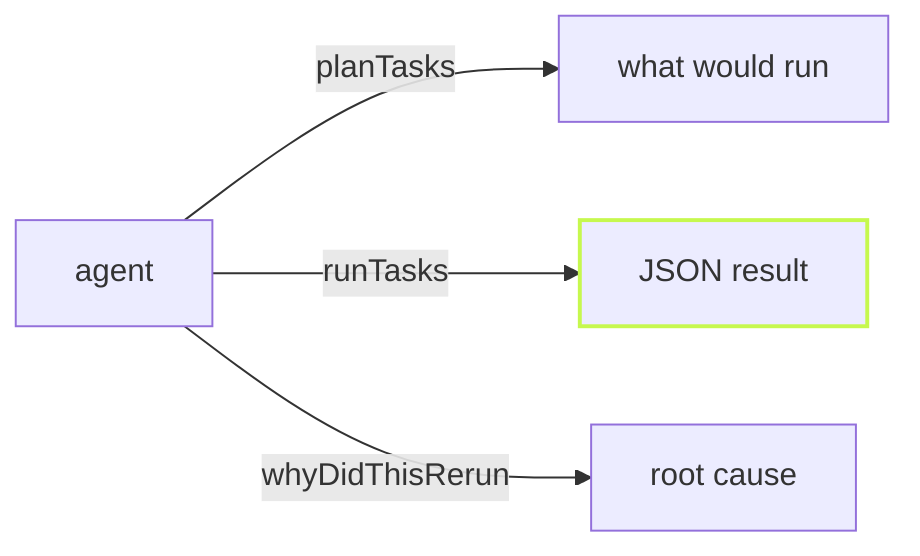

vx 0.0.626 to 0.0.632 shipped on 2026-10-08 and 2026-10-09. This batch
makes vx easy for an AI agent to drive: results as JSON, errors with
stable codes, failed output an agent can act on, and an MCP server that
runs and plans tasks. It also makes `vx init` the one command to adopt a
Turbo or Nx repo.

**In this release**

- [vx run speaks JSON](#vx-run-speaks-json)
- [Stable error codes](#stable-error-codes)
- [Failed output agents can act on](#failed-output-agents-can-act-on)
- [vx mcp runs and plans tasks](#vx-mcp-runs-and-plans-tasks)
- [Why a task is affected](#why-a-task-is-affected)
- [vx init adopts Turbo and Nx](#vx-init-adopts-turbo-and-nx)
- [One ordered log on a cache hit](#one-ordered-log-on-a-cache-hit)
- [Remote execution: TLS by default](#remote-execution-tls-by-default)

## vx run speaks JSON

`vx run --format json` prints one result object on stdout: each task's
status, exit code, duration and key, plus the time the cache saved and
the critical path. An agent reads one value instead of parsing a log.

```sh frame="terminal"
$ vx run build --all --format json 2>/dev/null
{
  "runId": "01a11f0d-014c-700d-a4ad-59e93a00a129",
  "ok": true,
  "exitCode": 0,
  "savedMs": 1270,
  "tasks": [
    { "id": "@demo/api#build", "status": "cache-hit", "durationMs": 3, ... }
```

PRs [#3271](https://github.com/vznjs/vx/pull/3271),
[#3296](https://github.com/vznjs/vx/pull/3296). Deep dive:
[Built for agents](../../blog/built-for-agents/)

## Stable error codes

Every refusal now carries a `VX_E_` code that does not change between
versions, so a script or an agent branches on the code, not the wording.
Unknown verbs, usage mistakes and the reading verbs' refusals are coded
too.

```sh frame="terminal"
$ vx run biuld --all --format json
{"ok":false,"error":{"code":"VX_E_UNKNOWN_TASK","message":"vx run: no projects declare task(s): biuld. Did you mean build?"}}
```

PRs [#3298](https://github.com/vznjs/vx/pull/3298),
[#3321](https://github.com/vznjs/vx/pull/3321),
[#3324](https://github.com/vznjs/vx/pull/3324). Deep dive:
[Error codes](../../blog/error-codes/)

## Failed output agents can act on

A failed task's output is kept for `vx last --failed`, and every
`file:line:col` in it becomes a location an agent can open and a
terminal can click.

```sh frame="terminal"
$ vx last --failed --format json | jq '.tasks[] | select(.output != "") | {status, locations}'
{
  "status": "failed",
  "locations": [
    { "file": "/work/demo/packages/ui/src/index.ts", "line": 3, "col": 7 }
  ]
}
```

vx also ships an agent skill (`skills/vx/SKILL.md`) and the JSON schemas
the docs point at.

PRs [#3273](https://github.com/vznjs/vx/pull/3273),
[#3264](https://github.com/vznjs/vx/pull/3264),
[#3288](https://github.com/vznjs/vx/pull/3288)

## vx mcp runs and plans tasks

`@vzn/vx-mcp` gained four tools: `runTasks` runs tasks and returns the
JSON result, `planTasks` returns what a run would do without running it,
`listTasks` narrows by `--filter` and `--affected`, and
`whyDidThisRerun` answers like `vx why`, root cause included.



PRs [#3289](https://github.com/vznjs/vx/pull/3289),
[#3303](https://github.com/vznjs/vx/pull/3303),
[#3320](https://github.com/vznjs/vx/pull/3320),
[#3300](https://github.com/vznjs/vx/pull/3300). Deep dive:
[Agents and MCP](../../blog/agents-and-mcp/)

## Why a task is affected

`--dry` now prints, under each task `--affected` kept, the changed file
that kept it and the dependency it came through.

```sh frame="terminal"
$ vx run build --all --affected=HEAD --dry
would run:
  ▶  @demo/docs#build  cache miss — would exec   e50d7ee9  ~309ms
                       affected: packages/ui/src/index.ts changed (an input), via @demo/ui#build
  ▶  @demo/ui#build    cache miss — would exec   e212d097  ~312ms
                       affected: packages/ui/src/index.ts changed (an input)
```

PR [#3276](https://github.com/vznjs/vx/pull/3276). Deep dive:
[See inside a run](../../blog/see-inside-a-run/)

## vx init adopts Turbo and Nx

In a repo with `turbo.json` or `nx.json`, `vx init` runs
`@vzn/vx-migrate`. It asks whether to write native config (a
`vx.config.ts` per package) or keep the repo's own config live;
`--native` and `--keep` answer up front. A Turbo remote cache or a
self-hosted Nx cache the repo already uses is kept.

```sh frame="terminal"
vx init --native
```

PRs [#3258](https://github.com/vznjs/vx/pull/3258),
[#3237](https://github.com/vznjs/vx/pull/3237). Deep dive:
[From Turborepo](../../blog/from-turborepo/)

## One ordered log on a cache hit

A task's stdout and stderr are now stored as one ordered log, so a cache
hit replays stderr too, in the order the task wrote it. Live and on a
hit, a task's output prints as one section.

PRs [#3251](https://github.com/vznjs/vx/pull/3251),
[#3248](https://github.com/vznjs/vx/pull/3248). Deep dive:
[Inside a cache hit](../../blog/inside-a-cache-hit/)

## Remote execution: TLS by default

`@vzn/vx-reapi` connects an endpoint with no scheme over TLS, as Bazel
does; plaintext takes `grpc://` or `tls: false`. A remote result can now write only the
outputs the task declares.

```ts
reapi({ endpoint: 'grpc://localhost:8980' })
```

PRs [#3265](https://github.com/vznjs/vx/pull/3265),
[#3256](https://github.com/vznjs/vx/pull/3256). Deep dive:
[Remote execution](../../blog/remote-execution/)

## Breaking changes

- The cache format is now `vx-cache-v42`: every cached task misses once after upgrading ([#3251](https://github.com/vznjs/vx/pull/3251)).
- `@vzn/vx-reapi`: an endpoint with no scheme now uses TLS; a plaintext server needs `grpc://` ([#3265](https://github.com/vznjs/vx/pull/3265)).

See [Upgrading](../../guides/upgrading/).

## How to update

```sh frame="terminal"
npm install -D @vzn/vx@latest
```

A standalone binary updates itself with `vx upgrade`.

## Learn more

- [AI agents guide](../../guides/agents/)
- [Quickstart](../../quickstart/)
- [Every release on GitHub](https://github.com/vznjs/vx/releases)
