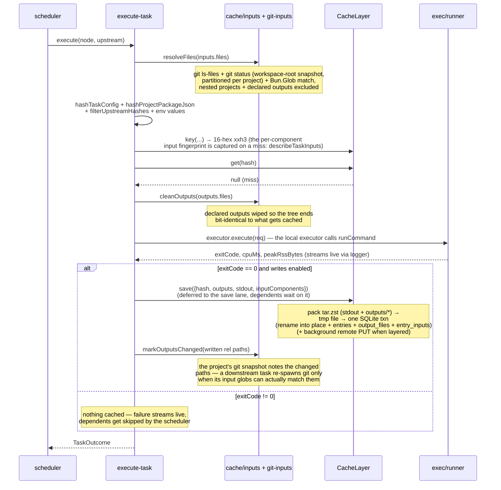
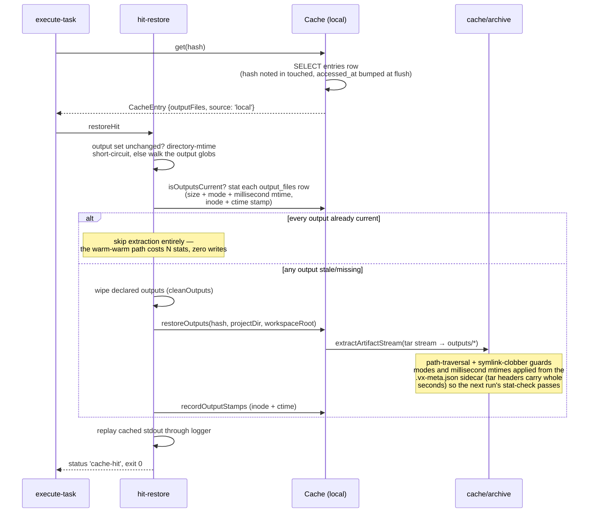
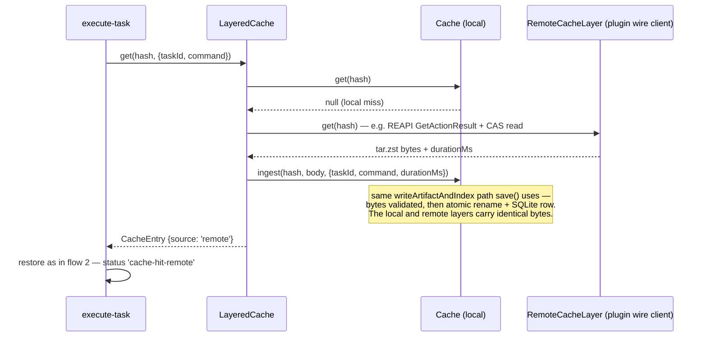
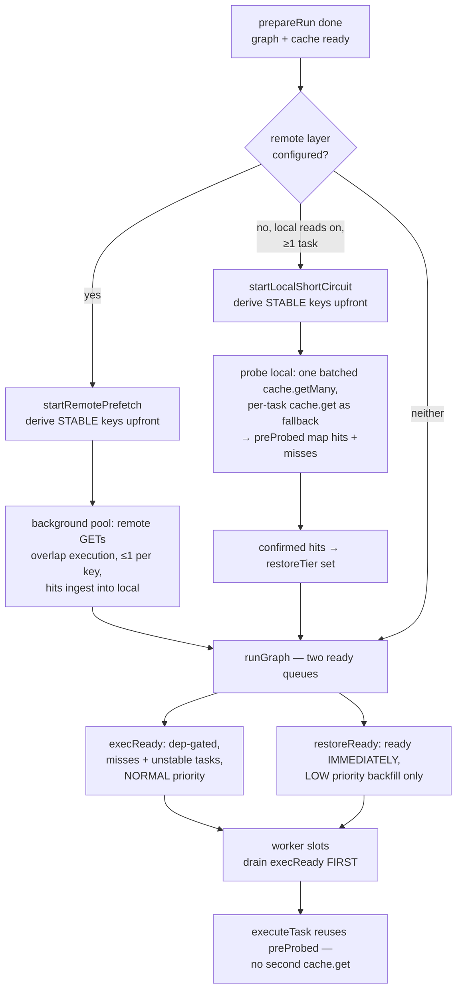
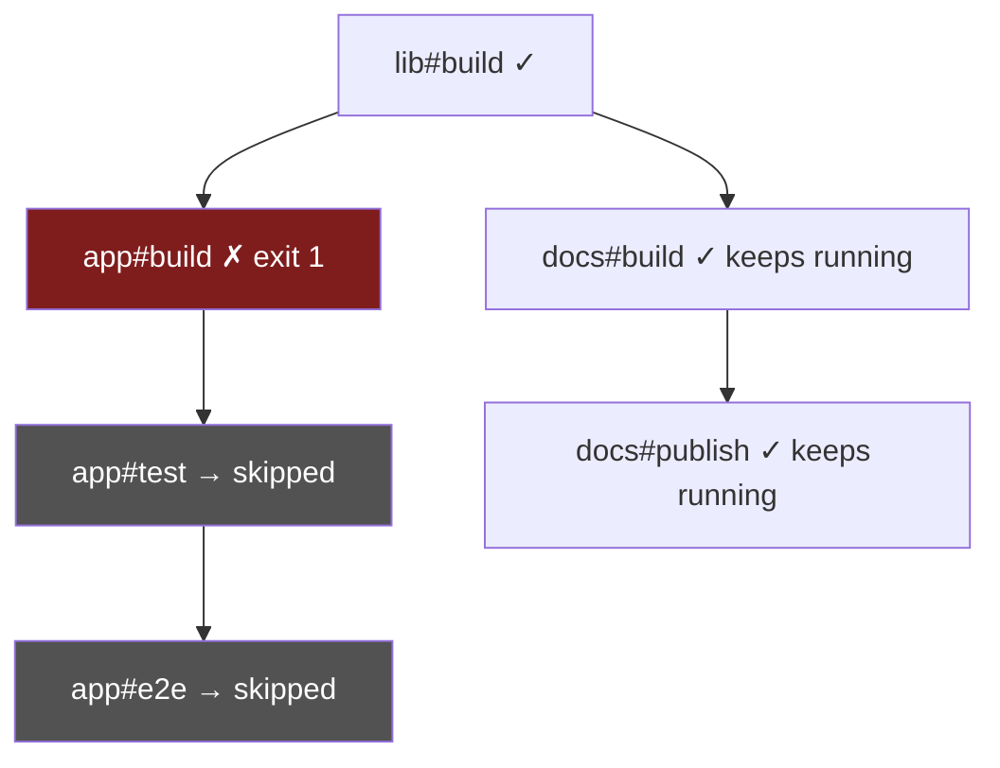
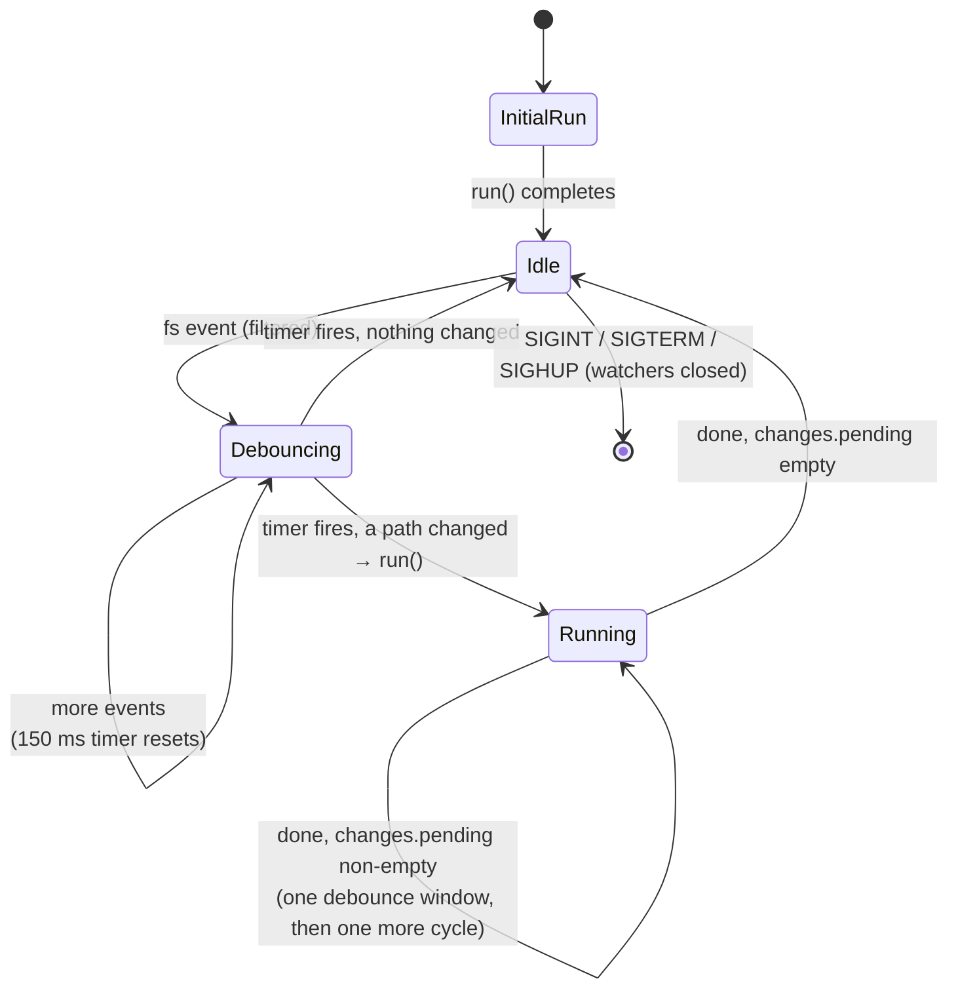
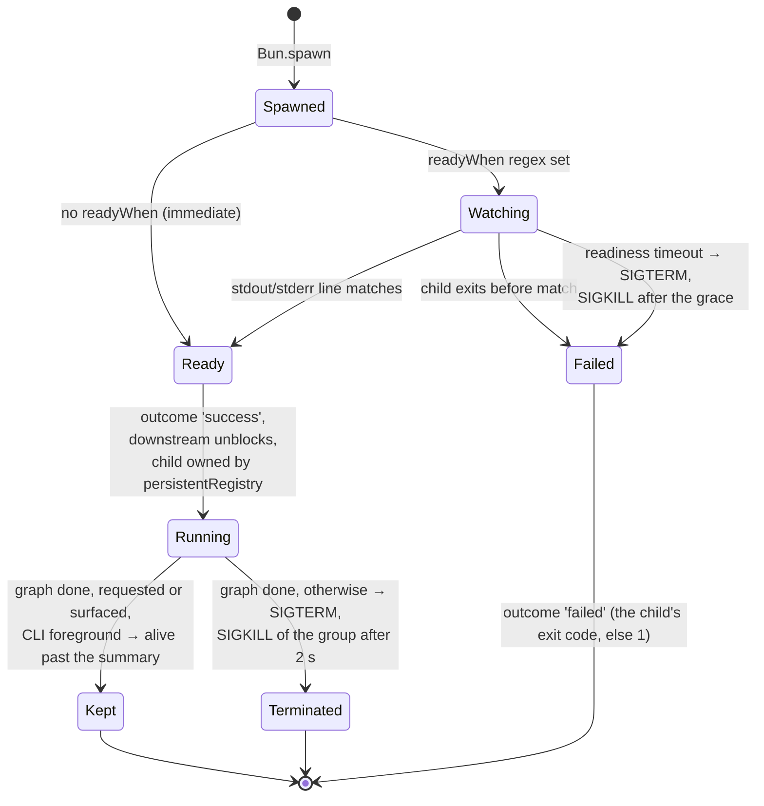
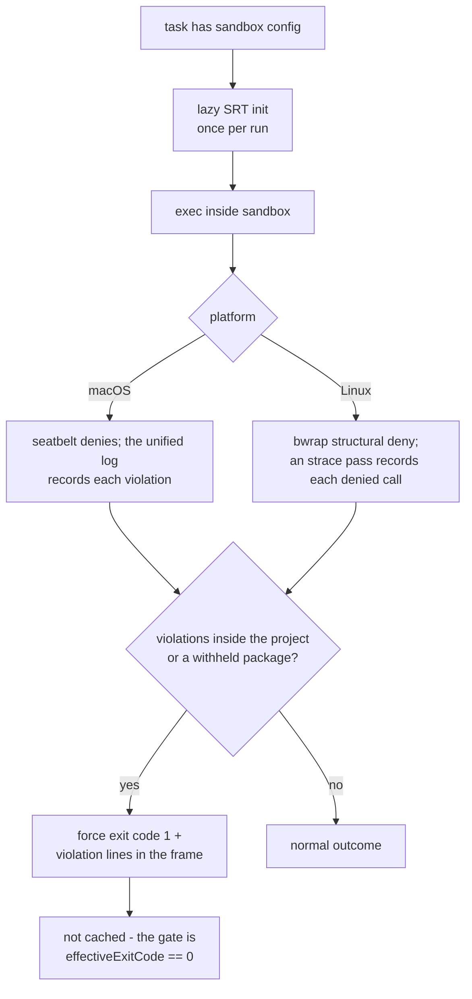
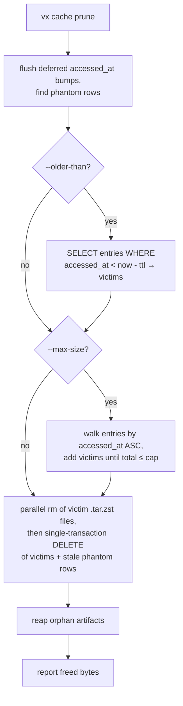
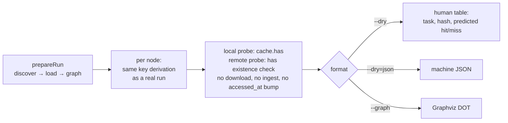

# Execution flows, scenario by scenario

Companion to [`execution.md`](./execution.md) (prose lifecycle) and
[`caching.md`](./caching.md) (key derivation). Each section is one
end-to-end scenario as a diagram, with the source files that own each
step. Diagrams are Mermaid — GitHub renders them inline.

## 1. Cold run — cache miss → exec → save

The path a task takes the first time it runs (or after any input
changed). Owners: `orchestrator/execute-task.ts` (sequence),
`cache/inputs.ts` + `cache/git-inputs.ts` (enumeration),
`cache/key-fold.ts` (key), `cache/cache.ts` (save),
`exec/runner.ts` (spawn).

## 2. Warm run — local cache hit

Owners: `cache/cache.ts:get`, `orchestrator/hit-restore.ts` (the up-to-date check and the restore), `cache/output-index.ts:isOutputsCurrent`, `cache/archive.ts:extractArtifactStream`.

## 3. Remote hit — download → ingest → restore

Owner: `cache/layered-cache.ts`. Requires a remote layer — a plugin's
`cache` capability or an injected `RunOptions.remoteCache` client
implementing `RemoteCacheLayer`.

On any remote error (timeout, non-404 failure, corrupt body) the
layered cache reports through `onRemoteError` and the task degrades
to a miss — remote problems never fail a run.

The write side is the mirror image: `LayeredCache.save` writes the
local artifact synchronously, then uploads the same bytes verbatim
(`RemoteCacheLayer.put`) as a **fire-and-forget background task**
— the task's outcome never waits on upload latency; `run()` drains
all in-flight uploads before closing the cache. Errors route to
`onRemoteError`.

In practice most remote hits never reach the lazy path above: the
**prefetch** pass (flow 3b) has already ingested them by the time
`execute-task` probes.

## 3b. Run pipeline — classify, prefetch, two-tier schedule

Owners: `orchestrator/run.ts` (wiring),
`orchestrator/stable-keys.ts` (the shared stability gate),
`orchestrator/remote-prefetch.ts`,
`orchestrator/local-shortcircuit.ts`, `graph/scheduler.ts`.

The stability gate is shared: a task whose inputs an upstream may write,
or whose outputs meet another same-project task's (M-5), has a
preliminary key and is never probed early. The upstreams counted
are transitive (a producer reached through a no-output intermediate
still counts): tasks declaring outputs, uncached tasks that may write
into their project or elsewhere in the workspace
(`undeclaredWriteReach`), cached tasks that may rewrite their own
inputs in place when this key does not fold theirs, and tasks that may
write a file the workspace fingerprint folds. Such a task stays
dep-gated with the always-correct lazy read-through. Restore-tier
tasks also bypass the failed-dep→skip check (their key is
dep-success-independent). Any error in classification degrades to the
plain schedule.

## 4. Failure propagation through the graph

Owner: `graph/scheduler.ts`. The scheduler distinguishes _transitive
dependents_ (skipped) from _independent siblings_ (keep running) —
Turbo's middle `--continue` setting.

Skipped outcomes carry exit code 1 and `durationMs: 0`; nothing is
spawned for them. The run's `ok` is false; the summary lists the
failed task IDs, then the skipped ones grouped under the failure that
blocked them.

## 5. `vx watch` — debounce + reentrancy

Owners: `cli/watch.ts`, `cli/watch-set.ts` (what is watched),
`cli/watch-filter.ts` (the path filter), `cli/watch-judge.ts` (which
settled paths are changes), `cli/watch-fs.ts` (watchers,
and the stat poller where they fail). One recursive `fs.watch` per project dir plus a
non-recursive watch of the workspace root, which fires for the
workspace fingerprint files (lockfiles), `vx.workspace.*`, the root
`package.json` and root files a plugin claims. When any task declares
`cache.inputs.workspaceFiles`, one recursive root watcher replaces them
all. Path filter drops the segments `node_modules`, `.git` and `.vx`,
the suffixes `.tsbuildinfo` and a trailing `~`, the run's resolved
cache dir (which `.vx` covers only until `cacheDir` relocates it), the
watch probe file, and declared outputs plus the directories holding
them (unless a task reads the path as an input). Git-ignored paths
(one `git check-ignore` per judgement) start no cycle, except an edit
under a project with an uncached task.

The `running` flag is the reentrancy guard: events landing mid-cycle
wait in `changes.pending`, are judged together one debounce window after
the cycle ends, and collapse into at most one follow-up run, never a
queue.

## 6. Persistent task lifecycle

Owner: `exec/runner.ts:runPersistent` + the orchestrator's
`persistentRegistry`. Persistent tasks (`exec.persistent`) gate
downstream work on readiness, then live until the rest of the graph
finishes. Then, in the CLI foreground (or held by `vx watch`), a
requested or surfaced persistent task is kept alive past the summary
(`orchestrator/persistent.ts`); the rest get SIGTERM, then SIGKILL of
the process group after a 2 s grace. `cache + persistent` is rejected
at load time.

## 7. Sandboxed task — violation → failure

Owner: `exec/sandbox-runtime.ts` (SRT wrapper). Activation is
per-task (`exec.sandbox`), no workspace inheritance. Baseline policy:
read and write nothing, deny-read = workspace root; core adds
`node_modules` and the workspace packages linked there (never a link to
the task's own project or above it; for a task that declares `cache`,
only the packages its key folds a task of —
`orchestrator/keyed-projects.ts`), and the task's own `allow` grants add
the rest. Reporting is scoped to the project and the withheld packages.

## 8. `vx cache prune` — TTL + LRU

Owner: `cli/cache.ts` + `cache/cache.ts:prune`. Both bounds can
combine; eviction is one SQL transaction (CASCADE clears
`output_files`) after parallel artifact unlinks. The same transaction
drops phantom rows (no artifact on disk) unused for an hour, and
artifacts with no row are reaped after it.

Every `get` notes its hash, and the `accessed_at` bumps land in one
batched UPDATE at prune, stats or close, so LRU reflects real use. A
`vx run --dry` plan probes with `has`, which does not bump it — planning
is read-only. (Prune's own rehearsal flag is `--dry-run`.)

## 9. `--dry` / `--graph` — the plan path

Owner: `orchestrator/plan.ts` + `cli/plan-format.ts`. Shares
`prepareRun` with the real path, probes the cache for predicted
hits with the byte-free `has`, spawns no task, and writes nothing —
not even the `accessed_at` bump a real `get` makes. It does run
`cache.inputs.runtime` / `workspaceRuntime` probe commands: a key
needs their answers.

Because the plan path and `execute-task` share the same key
derivation helpers, a predicted hit is exactly what the real run
would see (same process, same env, same tree). Against a remote
layer, planning uses a lightweight existence probe — a predicted
`hit-remote` moves no artifact bytes.
