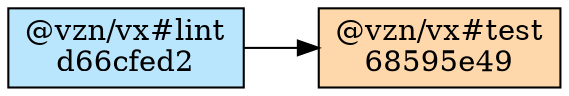

# `src/cli/plan-format.ts` — plan → text / JSON / DOT

## Purpose

Format a `RunPlan` (from [`plan.md`](./plan.md)) into one of three
output formats: human-readable text, structured JSON, or Graphviz
DOT. Pure functions; no I/O.

## Public surface

```ts
export function formatPlanText(plan: RunPlan): string
export function formatPlanJson(plan: RunPlan): string
export function formatGraphDot(plan: RunPlan): string
```

All three return a complete string with a trailing newline; the
caller writes it to stdout or a file (`Bun.write(path, out)`).

## `formatPlanText`

One line per real task — groups are hidden, as the live runner hides
them — with a status symbol, the cache prediction, the first eight
characters of the key and, on a task that would run and has history,
its typical duration (`~p50`). A `description` on the task config
renders on a second indented line under its row:

```
would run:
  ◉  @vzn/vx#format-check  cache hit (local)         02bfe8a9
  ↓  @vzn/vx#lint          cache hit (remote)        d66cfed2
                           oxlint with tsgolint-backed type-aware checks
  ▶  @vzn/vx#test          cache miss — would exec   68595e49  ~4.20s
  ·  @vzn/vx#dev           no-cache (would exec)     c0ffee00

4 task(s) planned, 2 cache hits (1 local, 1 remote), 1 would run, 1 no-cache.
predicted: ~4.20s wall · ~4.20s total execution · 1 task without history (+?)
```

Status symbols:

| Symbol | Status       |
| ------ | ------------ |
| `◉`    | `hit-local`  |
| `↓`    | `hit-remote` |
| `▶`    | `miss`       |
| `·`    | `no-cache`   |
| `○`    | `group`      |

The `predicted:` footer prints only when history gave the plan
something to say — at least one would-run task has a p50 — and counts
the would-run tasks without history as `(+?)`. A `--download` policy
adds a `download:` block: how many tasks would keep their outputs
remote and, up to three, the tasks the eligibility gate kept eager and
why.

**Placement** renders as a trailing `@<executor-name>` on tasks the plan
placed on an executor — and ONLY when the workspace declared more than one,
since with a single executor every line would carry the same label:

```
would run:
  ▶  @vzn/vx#test    cache miss — would exec   68595e49  ~4.20s  @vx/reapi
  ▶  @vzn/vx#docker  cache miss — would exec   1a0c33fe  @local

2 task(s) planned, 2 would run.
```

It is the executor's NAME, not a `local`/`remote` word: the summary line
already spends both of those on the cache tier ("2 cache hits (1 local, 1
remote)"), and the name is what a reader can act on. One label is not an
executor: `@noop` marks a `remote: 'only'` task no remote executor took —
it will not run ANYWHERE this run (dependents use the machine's ambient
state), and showing the local executor's name there would promise an
execution that never happens. See
[`schema.md` § `remote`](../schema.md#remote-optional) for what pins a task
locally and what `'only'` means.

## `formatPlanJson`

JSON-friendly object:

```json
{
  "tasks": [
    {
      "id": "@vzn/vx#lint",
      "project": "@vzn/vx",
      "task": "lint",
      "hash": "d66cfed2a1b2c3d4",
      "cacheStatus": "hit-remote",
      "deps": [],
      "description": "oxlint with tsgolint-backed type-aware checks"
    }
  ]
}
```

`p50Ms`, `executor` and `download` ride a task only when set, and
`predicted` and `downloadDowngrades` ride the object only when the plan
has them. The object enumerates its fields on purpose — the plan's
internal shape is not the wire — so a new `PlannedTask` field is not on
the wire until it is added here. For tooling —
`vx run <task> --dry=json | jq …`.

## `formatGraphDot`

Graphviz DOT with status-colored nodes. Groups are included — they are
nodes in the graph, just not units of work — and every node is labelled
with its id and the first eight characters of its key:



Fill colors by predicted status: green (local hit), sky blue (remote
hit), orange (miss), gray (no-cache), fuchsia (group). Edges point
dependency → dependent, unstyled. Ids and labels are DOT-escaped: a task
name is any object key in a config, so a quote, a backslash or a
newline is reachable and would otherwise end the string early.

```sh
vx run ci --graph | dot -Tsvg > graph.svg
vx run ci --graph=graph.dot
```

## Tests

`tests/plan-format.test.ts`:

- The text form hides groups, lines up every real task with its symbol
  and short hash, shows the description row only when set, and says so
  plainly on an empty or all-miss plan.
- The `~p50` and `predicted:` footer appear only with history; a task
  without it is counted as `(+?)`; an all-hit plan has no footer.
- JSON carries every planning field, `p50Ms` and `predicted` when present.
- DOT is a valid digraph with edges, per-status fill colours and group
  nodes; ids and labels are escaped.
- Placement: the executor name, omitted when the task carries none, a
  JSON field when present.
- The samples on this page are what the formatters print for the same
  fixture.
